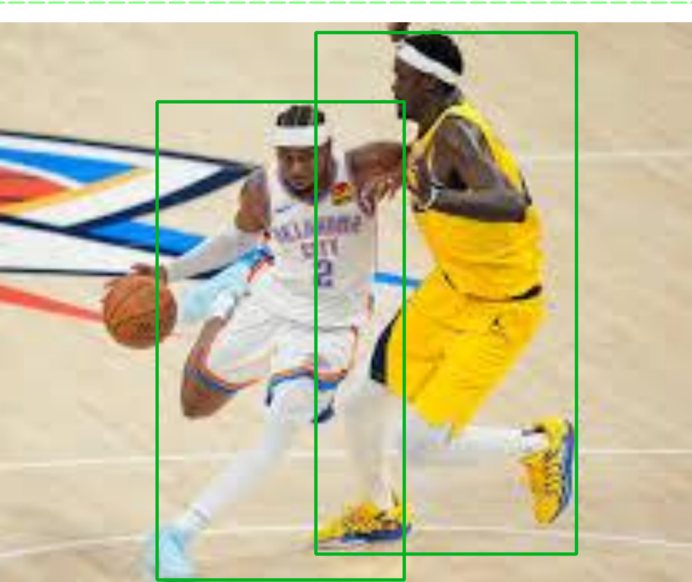

## 目的
微调 yolov8n 检测图片中有没有穿篮球衣的人

## 说明
由于数据集太少，精确度不高，本项目只是演示如何微调 yolo 模型

## 准备数据
mkdir basket
mkdir negative

## 准备正向数据
搜索 40 张 nba 图片，然后保存到 baseket 目录下

## 准备负向数据
搜索 10 张足球照片放到 negative 目录下
搜索 10 张普通人照片放到 negative 目录下
搜索 10 张美女图片放到 negative 目录下
搜索 10 张跑步的人放到 negative 目录下  

## 重命名这些图片
python step_1_rename.py

## 人工标注数据
用 AnyLabeling 标注 basket 目录下所有图片, 如：

negetive 目录下的图片不用标注

## 给图片创建 label
python step_2_generate_label.py

## 分配数据
python step_3_split_data.py

## 微调模型
yolo detect train \
  model=yolov8n.pt \
  data=data.yaml \
  epochs=80 \
  imgsz=640 \
  project=runs/train \
  name=basket_jersey

## 测试结果
yolo detect predict \
    model=runs/detect/runs/train/basket_jersey/weights/best.pt \
    source=test/1.jpg

# 微调模型
python step_4_train.py

## 测试模型
python step_5_predict.py

